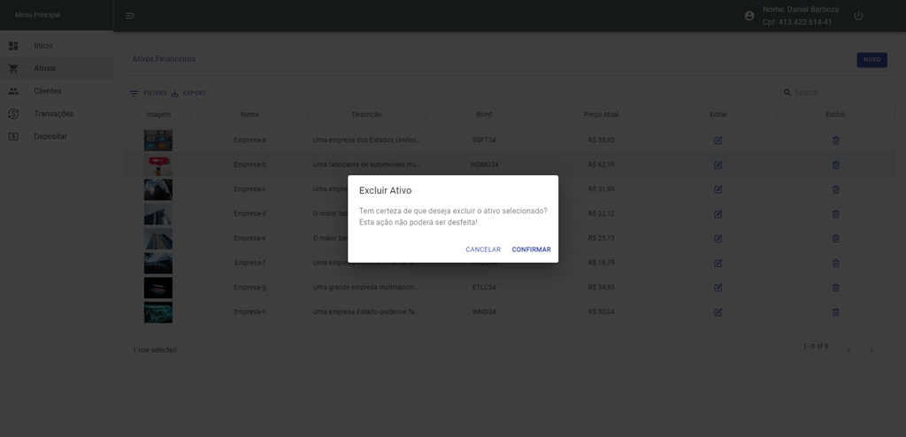
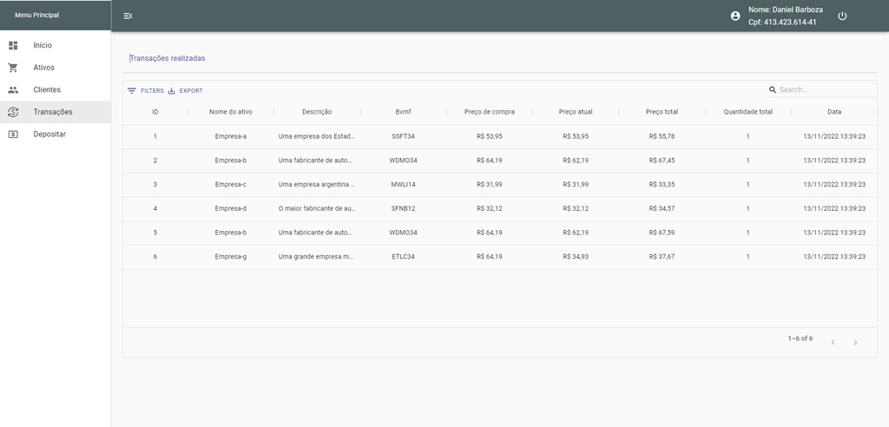

# **Front-End React Awesome Invest**
O Projeto AWESOME INVEST é um sistema de gestão financeira criado para fins de estudo. O Sistema tem como objetivo listar os ativos e efetuar o gerenciamento destes, possibilitando a consulta e a compra por parte do cliente. Além de garantir que o Administrador realize depósitos em contas de clientes e a consulta das transações realizadas.
O Front-End foi desenvolvido utilizando o ReactJs.
<br/>

A API foi desenvolvida utilizando o NodeJs, ExpressJs e o ORM Sequelize com Banco de dados MySql. E está disponível para consulta no link abaixo:
```
https://github.com/danielbarbozadasilva/financial-system-backend.git
```
<br/>

O Aplicativo foi desenvolvido utilizando o React Native utilizando o Typescript. E está disponível para consulta no link abaixo:

```
https://github.com/danielbarbozadasilva/app-financial-React-Native
```
<br/>
<br/>

## **Escopo do produto**
O AWESOME INVEST é um Sistema web que vem com o intuito de facilitar ao cliente investir em ativos. Todas as suas funcionalidades foram pensadas e elaboradas para proporcionar facilidade e comodidade aos usuários da plataforma.

O Sistema tem como objetivo gerenciar os ativos cadastrados, disponibilizando ao cliente a opção de adquiri-los. O administrador do sistema possui o controle dos ativos cadastrados, assim como dos clientes, com a possibilidade de realizar depósitos em conta de clientes e obter informações de transações realizadas.

Os usuários do sistema são os Clientes e o Administrador. Todos possuem acesso ao sistema e a seu respectivo espaço. Além disso o Sistema conta com uma tela inicial que permite ao público navegar de modo simples entre os ativos, os ativos mais adquiridos e informações da plataforma.
<br/>
<br/>

## **Instalação**
Clone o repositório na pasta de sua preferência.
```
https://github.com/danielbarbozadasilva/financial-system-frontend
```

Abra a pasta do repositório clonado, e crie um arquivo ".env", exemplo:
```
REACT_APP_API=http://localhost:3011
REACT_APP_VERSION=/v1
REACT_APP_TOKEN_KEY=gestao
```

Abra a pasta do repositório clonado, e instale as dependências do projeto através do comando:
```
yarn install
```

Execute o comando para rodar o projeto:
```
yarn start
```
<br/>

## **Requisitos funcionais**
<br/>

RF001 – O sistema deve controlar a autenticação dos usuários.

RF002 – O sistema deve manter cadastro de clientes.

RF003 – O sistema deve manter ativos.

RF004 – O sistema deve controlar a venda de ativos.

RF005 – O sistema deve manter clientes.

RF006 – O sistema deve aprovar ou bloquear o acesso do cliente.

RF007 – O sistema deve listar as transações efetuadas.

RF008 – O sistema deve realizar depósitos.

RF009 – O sistema deve listar os depósitos efetuadas.

RF010 – O sistema deve listar os dados bancários do cliente.

<br/>
<br/>

## **Requisitos não funcionais**
<br/>

| Identificação | Classificação | Descrição |
| --- | --- | --- |
|RNF001   |Implementação     |O back-end do sistema deve ser desenvolvido em NodeJs e ExpressJs.    |
|RNF002   |Implementação     | O front-end do sistema deve ser desenvolvido em ReactJs.    |
|RNF003   |Implementação     |O banco de dados a ser utilizado é o MySql.     |
|RNF004   |Implementação     | O sistema deve funcionar em Sistemas Operacionais Windows, Mac e Linux.    |
|  |  |  |

<br/>
<br/>

## **Regras de negócio**
<br/>

| Identificação | Classificação | Descrição |
| --- | --- | --- |
|RN001   |Controle de acesso     |Os acessos permitidos ao sistema serão: Administrador e Cliente. O usuário anônimo terá acesso apenas ao portal do site.    |
|RN002   |Aplicar imposto     | Em todas as vendas serão acrescidos 5% (cinco por cento) referente a impostos.    |
|RN003   |Controle de veracidade     |Apenas clientes autorizados pelo administrador poderão ter acesso ao sistema.     |
|RN004   |Limite de ação     | Apenas o Administrador poderá incluir, editar e excluir ativos no sistema.    |
|RN005   |Limite de ação     | Apenas o Administrador poderá editar os dados do cliente.     |
|RN006   |Limite de ação     | O Cliente poderá visualizar apenas os dados da sua conta. Tais como: patrimônio, histórico de transações e depósitos.     |
|RN007   |Limite de ação     | Apenas o Administrador poderá visualizar informações de todos os clientes, suas respectivas contas, patrimônio e transações efetuadas.    |
|  |  |  |

<br/>
<br/>

## **Lista de atores e casos de uso**
<br/>

## Lista de atores que interagem com o sistema:
* Administrador
* Cliente
* Anônimo
<br/>
<br/>

## Lista de Casos de Uso:
<br/>

1 - Fechar compra

2 - Registrar movimentação

3 - Realizar Login

4 - Manter ativos

5 - Manter clientes

6 - Aprovar cadastro de clientes

7 - Realizar depósitos

8 - Pesquisar ativos

<br/>
<br/>

> ## Licença
- Licença GPLv3
<br/>
<br/>
<br/>

> ## Metodologias e Padrões
* Responsive Layout
* Conventional Commits
* GitFlow
<br/>
<br/>
<br/>

> ## Bibliotecas e Ferramentas
* React
* Reach Router
* Styled-components
* Axios
* Git
* Eslint
* Standard Javascript Style
* Chart
* Material UI
* React-icons
* React-redux-toastr
* React-toast
* React-bootstrap
* Redux-multi
* Redux-thunk
* React-helmet
<br/>
<br/>
<br/>

> ## **Telas**
<br/>

## **Tela Inicial**
<br/>

<br/>
<br/>
<br/>
<br/>

## **Tela Top05 Investimentos**
<br/>

<br/>
<br/>
<br/>
<br/>

## **Tela de Login**
<br/>

<br/>
<br/>
<br/>
<br/>

## **Tela de Cadastro**
<br/>

<br/>
<br/>
<br/>
<br/>

## **Tela Inicial do Cliente**
<br/>

<br/>
<br/>
<br/>
<br/>

## **Tela Cliente Investimentos**
<br/>

<br/>
<br/>
<br/>
<br/>

## **Tela Cliente Investimentos - Adquirir Ativo**
<br/>

<br/>
<br/>
<br/>
<br/>

## **Tela Cliente - Buscar Ativo**
<br/>

<br/>
<br/>
<br/>
<br/>

## **Tela Cliente - Histórico de Transações Efetuadas**
<br/>

<br/>
<br/>
<br/>
<br/>

## **Tela Cliente - Histórico de Transações Efetuadas - Buscar transações**
<br/>

<br/>
<br/>
<br/>
<br/>

## **Tela Inicial do Administrador**
<br/>

<br/>
<br/>
<br/>
<br/>

## **Tela Administrador - Listar Ativos**
<br/>

<br/>
<br/>
<br/>
<br/>

## **Tela Administrador - Cadastrar Ativo**
<br/>

<br/>
<br/>
<br/>
<br/>

## **Tela Administrador - Editar Ativo**
<br/>

<br/>
<br/>
<br/>
<br/>

## **Tela Administrador - Excluir Ativo**
<br/>

<br/>
<br/>
<br/>
<br/>

## **Tela Administrador - Buscar Ativo**
<br/>

<br/>
<br/>
<br/>
<br/>

## **Tela Administrador - Consultar Clientes**
<br/>

<br/>
<br/>
<br/>
<br/>

## **Tela Administrador - Listar Ativos Adquiridos**
<br/>

<br/>
<br/>
<br/>
<br/>


## **Tela Administrador - Transações Realizadas**
<br/>

<br/>
<br/>
<br/>
<br/>


## **Tela Administrador - Listar Endereço**
<br/>

<br/>
<br/>
<br/>
<br/>


## **Tela Administrador - Editar Dados do Cliente**
<br/>

<br/>
<br/>
<br/>
<br/>


## **Tela Administrador - Buscar Cliente**
<br/>

<br/>
<br/>
<br/>
<br/>


## **Tela Administrador - Listar Transações Realizadas**
<br/>

<br/>
<br/>
<br/>
<br/>

## **Tela Administrador - Consultar Transação**
<br/>

<br/>
<br/>
<br/>
<br/>

## **Tela Administrador - Consultar Depósitos**
<br/>

<br/>
<br/>
<br/>
<br/>

## **Tela Administrador - Detalhes do Depósitos**
<br/>

<br/>
<br/>
<br/>
<br/>

## **Tela Administrador - Realizar Depósito**
<br/>

<br/>
<br/>
<br/>
<br/>

## **Tela Administrador - Buscar por Número da Conta**
<br/>

<br/>
<br/>
<br/>
<br/>

## **Responsividade - IPhone SE**
<br/>

## **Tela Inicial**
<br/>

<br/>
<br/>
<br/>
<br/>


## **Tela top 05**
<br/>

<br/>
<br/>
<br/>
<br/>
